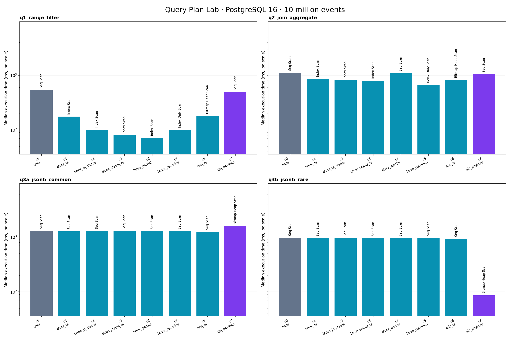

# Query Plan Lab

[](https://github.com/shravanibnikam/query-plan-lab/actions/workflows/tests.yml)

A reproducible PostgreSQL 16 experiment measuring how eight index choices change four query plans on 10 million events.

- **GIN made its target query 22.5% slower.** The common JSONB probe took 1,597.79 ms versus 1,304.71 ms without a secondary index. The rare probe was **11.29× faster** with the same GIN index.
- **An index-only scan was not the fastest q1 plan.** The 10 MB partial index took 71.95 ms versus 100.53 ms for the 404 MB covering index: **28.4% less time**, while the covering index used **38.6× the disk space**. The covering scan had zero heap fetches.

## Reproduce in two commands

Requirements: Docker Engine with Compose, Python 3.11+, make, SSD storage, at least 8 GB available RAM and 15 GB free disk space. Run from the cloned repository:

```sh
make up
make all
```

The second command installs dependencies in `.venv`, recreates the benchmark tables, loads the fixed dataset, benchmarks, runs and cleans up the append experiment, plots, regenerates this README, and checks acceptance. It can take tens of minutes or longer. Timings depend on host load and storage.

Individual steps: `make load`, `make bench`, `make stale`, `make chart`, `make readme`; `make test` runs correctness tests. `make down` preserves data; `make clean` deletes the benchmark volume and generated results.

## Hardware and reproducibility

- CPU: 12th Gen Intel(R) Core(TM) i7-1255U; 12 logical CPUs.
- Host RAM: 15.30 GiB (container limits, if configured, may be lower).
- OS: Linux-6.18.51-1-lts-x86_64-with-glibc2.44.
- Python: 3.14.7; psycopg 3.3.3, numpy 2.4.3, pandas 3.0.1, matplotlib 3.10.8.
- Host storage devices: KBG50ZNS512G NVMe KIOXIA 512GB.
- Server: PostgreSQL 16.15 (Debian 16.15-1.pgdg13+2) on x86_64-pc-linux-gnu, compiled by gcc (Debian 14.2.0-19) 14.2.0, 64-bit.

PostgreSQL data lives in a named Docker volume. The server settings below are pinned so configurations share a cost model and resource budget. `random_page_cost = 1.1` assumes SSD storage; storage hardware is not inferred from that setting. JIT is off to remove compilation variance, and I/O timing is enabled.

```conf
listen_addresses = '*'
shared_buffers = 1GB
effective_cache_size = 3GB
work_mem = 64MB
maintenance_work_mem = 1GB
random_page_cost = 1.1
seq_page_cost = 1.0
max_worker_processes = 8
max_parallel_workers = 8
max_parallel_workers_per_gather = 2
jit = off
track_io_timing = on
```

Observed server settings are preserved in [environment.json](results/environment.json). These controls improve within-machine comparisons; they do not make different machines equally fast.

## Dataset

- 10,000,000 events; 200,000 accounts; seed 20260101; anchor 2026-01-01 UTC.
- Observed event timestamps: 2024-01-01T00:01:15+00:00 to 2025-12-31T23:59:59+00:00.
- Observed `pg_stats.correlation` for `events.created_at`: **1.000000**. This quantifies the physical ordering that makes BRIN useful.
- Status counts: failed 500,051, ok 8,000,146, pending 1,499,803.
- Amount NULL: 2.004%; closed_at NULL: 40.004%.
- Distinct payloads: 5,000; mobile selectivity: 34.994%; beta selectivity: 0.501%.

q1 returns account_id, created_at, and amount for failed events in the final seven days. q2 joins accounts and aggregates ok events in the final 30 days. q3a and q3b aggregate JSONB containment matches for mobile and beta respectively.

## Results



Each cell is the median of five executions after one warm-up. Ratios are actual / estimated rows; 1 is accurate, values above 1 indicate underestimation. The normalized ratio accounts for parallel estimates; raw ratios remain available in runs.csv.

| Configuration | Query | Median ms | Events scan | Raw ratio | Normalized ratio |
|---|---|---:|---|---:|---:|
| c0_none | q1_range_filter | 538.534 | Seq Scan | 2.405 | 1.002 |
| c0_none | q2_join_aggregate | 1115.322 | Seq Scan | 2.419 | 1.008 |
| c0_none | q3a_jsonb_common | 1304.709 | Seq Scan | 2.517 | 1.049 |
| c0_none | q3b_jsonb_rare | 976.127 | Seq Scan | 121.300 | 50.542 |
| c1_btree_ts | q1_range_filter | 176.104 | Index Scan | 2.365 | 0.985 |
| c1_btree_ts | q2_join_aggregate | 863.600 | Index Scan | 2.368 | 0.987 |
| c1_btree_ts | q3a_jsonb_common | 1282.064 | Seq Scan | 2.080 | 0.867 |
| c1_btree_ts | q3b_jsonb_rare | 960.395 | Seq Scan | 121.595 | 50.664 |
| c2_btree_ts_status | q1_range_filter | 99.642 | Index Scan | 1.020 | 1.020 |
| c2_btree_ts_status | q2_join_aggregate | 808.849 | Index Scan | 2.400 | 1.000 |
| c2_btree_ts_status | q3a_jsonb_common | 1298.258 | Seq Scan | 2.194 | 0.914 |
| c2_btree_ts_status | q3b_jsonb_rare | 957.647 | Seq Scan | 120.716 | 50.298 |
| c3_btree_status_ts | q1_range_filter | 79.920 | Index Scan | 1.002 | 1.002 |
| c3_btree_status_ts | q2_join_aggregate | 799.546 | Index Scan | 2.416 | 1.007 |
| c3_btree_status_ts | q3a_jsonb_common | 1296.060 | Seq Scan | 2.436 | 1.015 |
| c3_btree_status_ts | q3b_jsonb_rare | 958.609 | Seq Scan | 121.595 | 50.664 |
| c4_btree_partial | q1_range_filter | 71.951 | Index Scan | 1.037 | 1.037 |
| c4_btree_partial | q2_join_aggregate | 1090.199 | Seq Scan | 2.396 | 0.998 |
| c4_btree_partial | q3a_jsonb_common | 1284.682 | Seq Scan | 2.453 | 1.022 |
| c4_btree_partial | q3b_jsonb_rare | 959.133 | Seq Scan | 121.007 | 50.420 |
| c5_btree_covering | q1_range_filter | 100.529 | Index Only Scan | 0.987 | 0.987 |
| c5_btree_covering | q2_join_aggregate | 670.708 | Index Only Scan | 2.351 | 0.979 |
| c5_btree_covering | q3a_jsonb_common | 1288.431 | Seq Scan | 2.703 | 1.126 |
| c5_btree_covering | q3b_jsonb_rare | 971.508 | Seq Scan | 121.595 | 50.664 |
| c6_brin_ts | q1_range_filter | 182.049 | Bitmap Heap Scan | 2.362 | 0.984 |
| c6_brin_ts | q2_join_aggregate | 827.362 | Bitmap Heap Scan | 2.402 | 1.001 |
| c6_brin_ts | q3a_jsonb_common | 1250.454 | Seq Scan | 2.748 | 1.145 |
| c6_brin_ts | q3b_jsonb_rare | 933.247 | Seq Scan | 121.300 | 50.542 |
| c7_gin_payload | q1_range_filter | 493.802 | Seq Scan | 2.338 | 0.974 |
| c7_gin_payload | q2_join_aggregate | 1042.249 | Seq Scan | 2.397 | 0.999 |
| c7_gin_payload | q3a_jsonb_common | 1597.793 | Bitmap Heap Scan | 2.036 | 0.848 |
| c7_gin_payload | q3b_jsonb_rare | 86.423 | Bitmap Heap Scan | 50.758 | 50.758 |

## Index cost

Builds are measured once per index. Primary-key costs are common to all configurations and excluded.

| Configuration | Index | Build seconds | Size | Bytes |
|---|---|---:|---|---:|
| c1_btree_ts | `events_ts` | 2.785 | 189 MB | 198,459,392 |
| c2_btree_ts_status | `events_ts_status` | 3.406 | 264 MB | 276,463,616 |
| c3_btree_status_ts | `events_status_ts` | 8.150 | 264 MB | 276,832,256 |
| c4_btree_partial | `events_failed_ts` | 0.806 | 10 MB | 10,952,704 |
| c5_btree_covering | `events_covering` | 3.651 | 404 MB | 423,297,024 |
| c6_brin_ts | `events_brin_ts` | 1.860 | 304 kB | 311,296 |
| c7_gin_payload | `events_payload` | 17.781 | 105 MB | 110,149,632 |

Exact DDL is in [index_meta.csv](results/index_meta.csv).

## Findings

- **q1_range_filter:** c4_btree_partial is fastest at 71.951 ms versus 538.534 ms without a secondary index (7.48×).
- **q2_join_aggregate:** c5_btree_covering is fastest at 670.708 ms versus 1115.322 ms without a secondary index (1.66×).
- **Containment selectivity:** GIN's baseline/index time ratio is 0.82× for the 34.99% mobile probe, compared with 11.29× for the 0.50% beta probe. Values below 1 indicate a slowdown.
- **Storage tradeoff:** BRIN occupies 304 kB, while the covering B-tree occupies 404 MB. Their q1 medians are 182.049 ms and 100.529 ms respectively. The observed physical ordering supports BRIN; this result should not be generalized to randomly ordered heaps.
- **Column order:** q1 takes 99.642 ms with (created_at, status), and 79.920 ms with (status, created_at). The latter can bound the equality predicate before the timestamp range.

## Annotated plans

### Sequential baseline

The filter discards rows after reading the heap; compare its removed-row count with the output count.

Median execution: **538.534 ms**. [Full JSON plan](results/plans/c0_none__q1_range_filter__run3.json).

```text
Gather: estimated=106064, actual/loop=106271, loops=1
  Seq Scan (parallel) on events: estimated=44193, actual/loop=35424, loops=3
    Filter: ((created_at >= '2025-12-25 00:00:00+00'::timestamp with time zone) AND (created_at < '2026-01-01 00:00:00+00'::timestamp with time zone) AND (status = 'failed'::text))
    Rows Removed by Filter: 3297910
```

### Covering index

The index includes every selected column. Heap Fetches shows whether visibility checks still needed heap access.

Median execution: **100.529 ms**. [Full JSON plan](results/plans/c5_btree_covering__q1_range_filter__run4.json).

```text
Index Only Scan on events using events_covering: estimated=107700, actual/loop=106271, loops=1
  Index Cond: ((created_at >= '2025-12-25 00:00:00+00'::timestamp with time zone) AND (created_at < '2026-01-01 00:00:00+00'::timestamp with time zone) AND (status = 'failed'::text))
  Heap Fetches: 0
```

### GIN rare probe

GIN identifies matching tuple locations; a bitmap heap scan retrieves amounts and applies any required recheck.

Median execution: **86.423 ms**. [Full JSON plan](results/plans/c7_gin_payload__q3b_jsonb_rare__run5.json).

```text
Aggregate: estimated=1, actual/loop=1, loops=1
  Bitmap Heap Scan on events: estimated=987, actual/loop=50098, loops=1
    Recheck Cond: (payload @> '{"beta_cohort": true}'::jsonb)
    Bitmap Index Scan using events_payload: estimated=987, actual/loop=50098, loops=1
      Index Cond: (payload @> '{"beta_cohort": true}'::jsonb)
```

## Stale statistics

Append 500,000 events beyond the old timestamp histogram, then run the same join before and after ANALYZE. Both phases use only primary-key indexes and report the median of five runs after a warm-up.

| Statistics | Median ms | Estimated events rows/participant | Actual events rows total | Raw ratio | Normalized ratio |
|---|---:|---:|---:|---:|---:|
| Before ANALYZE | 1228.776 | 1 | 399,882 | 399882.000 | 166617.500 |
| After ANALYZE | 607.683 | 144,226 | 399,882 | 2.773 | 1.155 |

ANALYZE improved execution time by **2.02×**. Normalized ratios compare total actual and estimated rows, accounting for parallel participants. EXPLAIN rounds per-loop averages, so multiplying them can differ slightly from the exact Gather output.

The underestimate is the finding; the modest speedup reflects cached inner lookups. `accounts_pkey` ran 399,881 times with **1,599,524 shared hits and 0 shared reads**. Repeated in-memory probes are survivable. The same underestimate could be much more costly with a larger inner relation or cache misses; that scenario was not measured here.

### Before ANALYZE

```text
Nested Loop: Plan Rows: 1, Actual Rows: 399881, Actual Loops: 1
  Gather: Plan Rows: 1, Actual Rows: 399881, Actual Loops: 1
    Parallel Seq Scan on events: Plan Rows: 1, Actual Rows: 133294, Actual Loops: 3
  Index Scan using accounts_pkey
    Plan Rows: 1, Actual Rows: 1, Actual Loops: 399881
    Shared Hit Blocks: 1599524, Shared Read Blocks: 0
```

[Full JSON plan](results/plans/stale__before__run5.json).

### After ANALYZE

```text
Parallel Hash Join: Plan Rows: 144226, Actual Rows: 133294, Actual Loops: 3
  Parallel Seq Scan on events: Plan Rows: 144226, Actual Rows: 133294, Actual Loops: 3
  Parallel Hash: Plan Rows: 117647, Actual Rows: 66667, Actual Loops: 3
    Parallel Seq Scan on accounts
      Plan Rows: 117647, Actual Rows: 66667, Actual Loops: 3
      Shared Hit Blocks: 1283, Shared Read Blocks: 0
```

[Full JSON plan](results/plans/stale__after__run2.json).

The inner index scan's loop count is distinct from the nested loop's output row count. [Full experiment and cleanup record](results/stale_stats.md).

## Acceptance results

These are measured checks, including hardware-sensitive expectations from the build specification.

| Check | Result |
|---|---|
| 160 complete measurements | PASS |
| five unique runs per matrix cell | PASS |
| all seven secondary indexes recorded | PASS |
| q1 has an Index Only Scan | PASS |
| rare GIN probe at least 10x faster | PASS |
| stale underestimate exceeds 1000x | PASS |
| fresh estimate within a factor of two | PASS |

## This query is slow: what do you do?

Start with EXPLAIN (ANALYZE, BUFFERS) and compare estimated versus actual rows at the first misestimated scan or join. Account for loops and parallel workers. A large mismatch calls for checking stale statistics and data skew before adding an index. ANALYZE can correct the cost inputs, though the resulting plan still needs measurement.

When estimates are sound, inspect rows filtered, heap fetches, statement-level reads, and temporary writes. Match the index to the predicate and selected columns. Re-measure representative common and rare values, and weigh median latency against index size, build time, and write-maintenance costs. This experiment measures reads and builds; it does not quantify ongoing write amplification.

## Decisions

- Fixed seed, fixed dates, and globally ordered timestamps; the clipped Zipf distribution is disclosed.
- One warm-up and five kept runs per query; report medians from a single machine with warm caches.
- Explicit vacuum enables index-only scans; the stale case keeps only primary-key indexes and cleans up its appended rows.
- Normalize parallel row estimates, preserve raw counts, and use root buffer counters to avoid counting child work twice.
- Pin dependencies and server settings, record the actual server version, and report failed expectations without forcing plans.

See [Methodology](docs/METHODOLOGY.md) for all generation choices, parsing rules, sources, and limitations. See [Explaining the results](docs/EXPLAINING_RESULTS.md) for plan-reading examples and the write-amplification discussion.

## License

[MIT](LICENSE).
